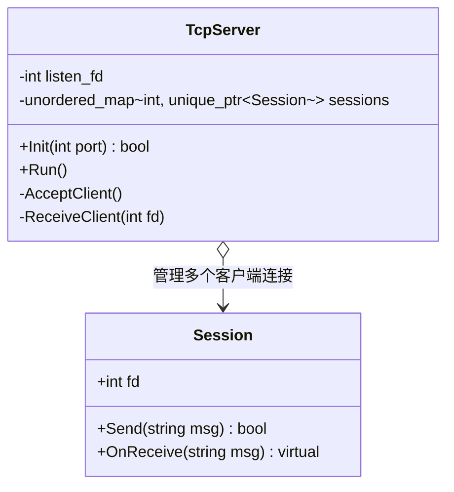
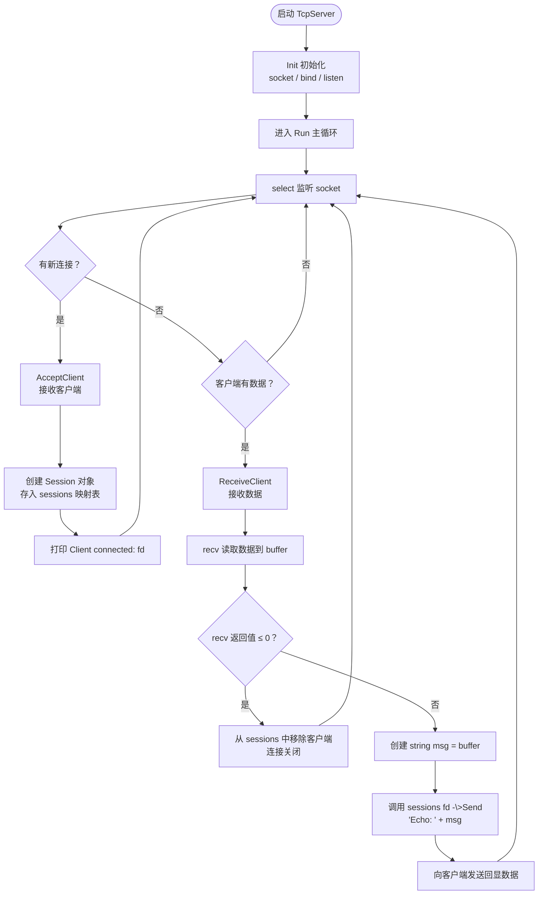
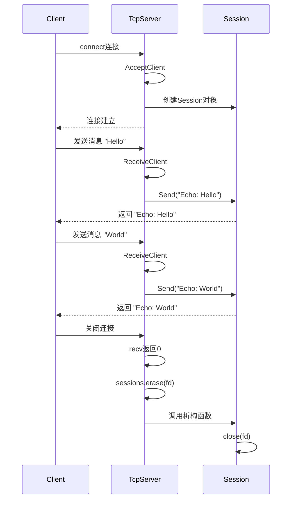
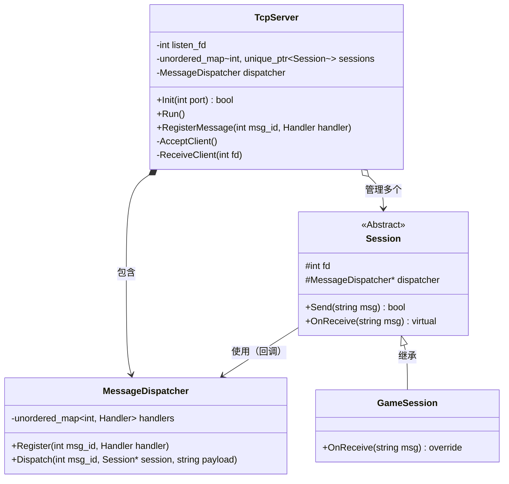
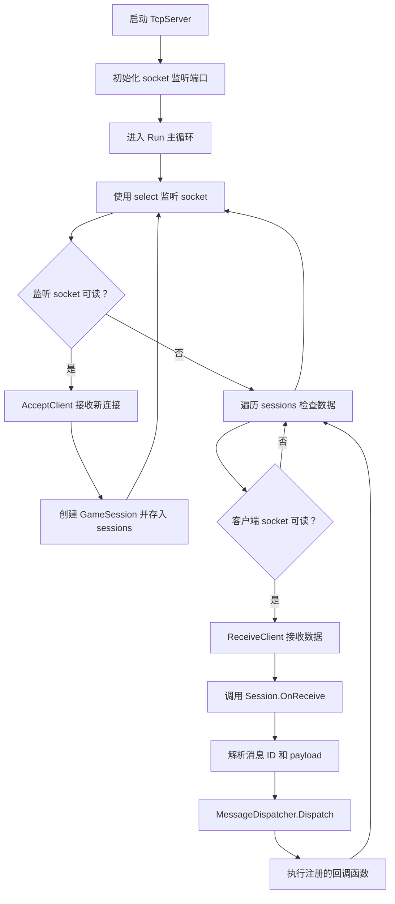
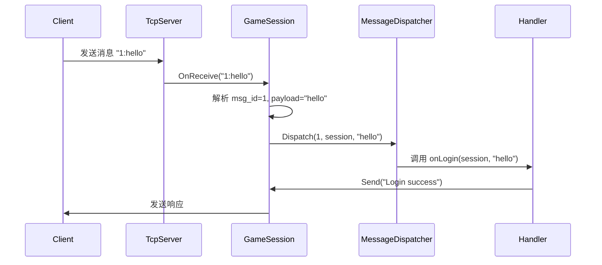

# Architecture

## 设计原则

### 网络层独立

以后可以换

- select
- epoll
- io_uring
- boost.asio

而业务逻辑不改

### Session = Actor 思想

每个客户端

- 有独立状态
- 有消息队列
- 不会直接互相调用

这是现代服务器非常主流的模式

### Dispatcher驱动业务逻辑

统一

```
Message ID
v
Handler Function
v
Business Logic Service
```

## 目录结构

```text
GameServer/

├── Network/
│   ├── SocketServer.h
│   ├── SocketServer.cpp
│   ├── Session.h
│   └── Session.cpp
│
├── Message/
│   ├── Message.h
│   ├── MessageDispatcher.h
│
├── Service/
│   ├── LoginService.h
│   ├── RoomService.h
│
├── Core/
│   ├── GameServer.h
│   ├── GameServer.cpp
│
└── main.cpp
```

## 开发阶段

### 第一阶段

- Epoll Reactor模型
- 二进制协议（自定义Pack/Unpack）
- Connection Pool
- Thread Pool

### 第二阶段

- Actor Message Queue
- Lock-free RingBuffer
- Hot Reload Logic DLL
- Lua Script Service

### 第三阶段

- 分布式GameServer Cluster
- Gateway + Logic Server
- State Synchronization Framework

## v0.1.0

### 架构图



### 运行流程图



### 时序图



## v0.1.1

### Class Diagram



### 运行流程图



### 时序图

