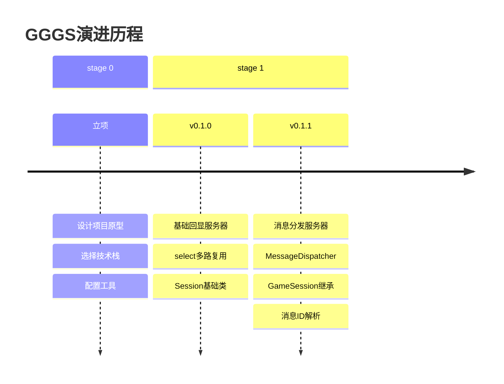

# 202602261900

```text
项目需要epoll，但客户端是Unity写的，需要在Windows上的Linux环境进行开发，WSL成为首选
WSL + VSCode开发环境配置
```

---

# 202602262000  [v0.1.0]

## 特性

- select模式
- 回显“Echo msg”

## 结构

```text
src/
├── core/
│   ├── Session.h
│
├── network/
│   ├── TcpServer.h
│   ├── TcpServer.cpp
│
├── main.cpp
```


---

# 202602270800 [v0.1.1]

## 特性

- 创建消息分发器
- 升级Session类
- 创建GameSession
- 注册业务处理函数

```text
src/
|__core/
|  |__MessageDispatcher.h
|  |__Session.h
|
|__network/
|  |__TcpServer.cpp
|  |__TcpServer.h
|
|__main.cpp

```

---